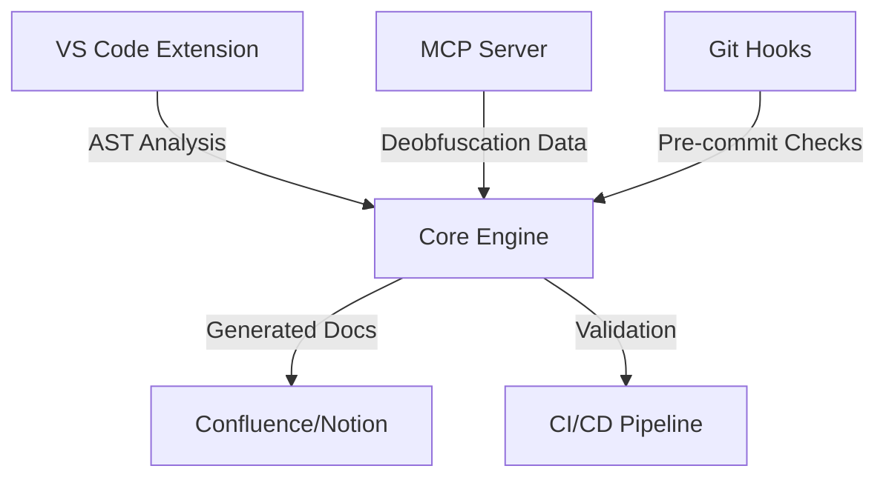

# doc-code-sync 🔄

**Automated Code-Documentation Synchronization Tool**  

Keep your code and documentation in perfect harmony.  
Doc-Sync automatically generates, validates, and updates docs from code annotations.

[](LICENSE)


---

## 🌟 Features

- **Auto-generate documentation** from code
- **Real-time validation** to detect outdated docs  
- **Multi-platform support**: Markdown, Confluence, Notion  
- **IDE Integration**: VS Code plugin for local checks 
- **Git Hooks & CI/CD**: Block commits with outdated documentation (maybe) 

```python
# Example: Python  → Markdown/Confluence
def calculate(a: int, b: int) -> int:
    """Sum two numbers.
    
    Args:
        a: First number
        b: Second number
        
    Returns:
        Sum result
    """
    return a + b
```

## 🏗 System Architecture

